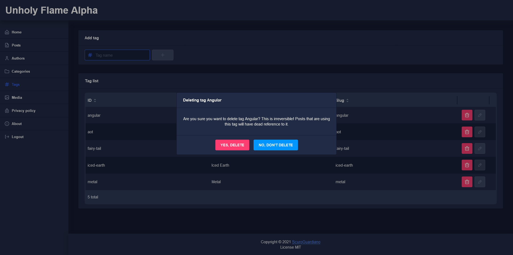

# Unholy Flame - work in progress

This is my **work in progress** CMS-like something for Firebase.  
Basically it's a blog management.  
The concept is to use only Spark plan without any Cloud Functions or something like that.  

## Created with ❤ using Angular and
* [Nebular](https://akveo.github.io/nebular/) for UI
* [ngx-datatable](https://swimlane.github.io/ngx-datatable/) for tables
* [AngularFire](https://github.com/angular/angularfire) for Angular Firebase services
* [slugify](https://github.com/simov/slugify) to generate nice slugs from titles
* [sass](https://sass-lang.com/) for styling

### How to run this
1. Paste your firebase config into `src/environments/environment.ts`
2. Copy rules from `firebase/security.rules` and paste it into your firestore rules
3. Create user with email on firebase console
4. In Firestore create collection `admins` and document in it:
    ```json
    "<USER UID>": {
      "enabled": true
    }
    ```
5. `npm install` and `npm start`

### Cool screen from Alpha


# LICENSE
MIT
